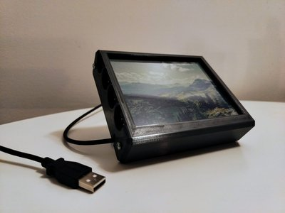

# inky-display-modes / inkyfuncmap

Display various functions on an inky impression 5.7" display.

This project can likely be adapted to work with other "inky" displays, with a few tweaks.

It can also be ran on a "mock" inky display (tkinter window), as a desktop toy / distraction.

Thanks to, but not affiliated with [pimoroni's inky python library.](https://github.com/pimoroni/inky)

## Preview





## Requires

* linux / bash
* python 3
* python venv
* make
* See [setup.py for install_requires](./setup.py)

## Recommended

* Raspberry Pi with 40-pin header
* Raspberry Pi OS
* Inky Impression display (pimoroni)

## Optional

* cowsay
* curl
* neofetch

## Usage

```
# Build python venv virtual environment
make

# Run
make run

# Help
make help
```

## License

* See ``LICENSE`` & ``licenses/pimoroni_inky.txt``
* For ``./img/`` assets ``licenses/pixnio.txt``

## Display information:

Inky Impression 5.7" 7 colour ePaper/eInk raspberry pi HAT.

* UC8159
* 5.7" EPD display (600 x 448 pixels)
* ACeP (Advanced Color ePaper) 7-color with black, white, red, green, blue, yellow, orange.
* Viewing angle 170°
* Dot pitch 0.1915 x 0.1915mm
* Compatible with 40-pin header Raspberry Pi's
* Overall dimensions: 125.4 x 99.5 x 9mm (W x H x D, depth includes header and display)
* Display usable area dimensions: 114.9 x 85.8mm (W x H)A
* [product](https://shop.pimoroni.com/products/inky-impression-5-7?variant=32298701324371)
* [pinout](https://pinout.xyz/pinout/inky_impression)
* [schematic](https://cdn.shopify.com/s/files/1/0174/1800/files/inky_impression_5_7_schematic.pdf?v=1664454872)
* [drawing](https://cdn.shopify.com/s/files/1/0174/1800/files/inky-impression-5.7-drawing.png?v=1714386682)
* [python library](https://github.com/pimoroni/inky)

## Button mapping:

To configure function mappings modify ``config.py``

Physical screen buttons are mapped as 1, 2, 3, 4

When run as a "mock" desktop gui, use keyboard keys: 1, 2, 3, 4.

Button mappings:

* 1 - play current mode
* 2 - previous mode
* 3 - next mode
* 4 - reset and display all modes

modes:

* menu
* image
* image (auto play)
* cowsay
* cowsay (auto play)
* hackaday news
* weather
* nasa images
* hello world
* ps running processes
* uptime
* fetch
* fortune
* noise

## Auto start on raspberry pi & optional image upload/download

To startup via rc-local edit ``/etc/rc.local``:

```
#!/bin/sh -e
# rc.local
# This script is executed at startup

# Run inkyfuncmap
bash -c 'cd /home/pi/inky-display-modes/ ; source ./venv/bin/activate; env INKY_IMG_DIR=/home/pi/inky-display-modes/img python -m inkyfuncmap' &

# Optionally run a image upload/download server:
# See docs here: https://pypi.org/project/uploadserver/
bash -c 'cd /home/pi/inky-display-modes/ ; source ./venv/bin/activate; cd img; python3 -m uploadserver --basic-auth inky:pleasechangeme!' &

exit 0
```

Then ensure it is running:
```
sudo systemctl stop rc-local
sudo systemctl start rc-local
sudo systemctl enable rc-local
sudo systemctl status rc-local
```

Alternatively use another init / startup mechanism.


## Case build


The fit was a bit too tight, and made to accommodate a pi 3 whereas a zero would probably be more reasonable.

I'd suggest one of these open source designs instead:

* https://github.com/scripsi/inky-impression-case
* https://github.com/printminion/pimoroni-Inky-Impression-4-image-frame

You might also be interested in other similar projects:

* https://github.com/vwillcox/Inky-Impression-Weather-Station
* https://github.com/kotamorishi/weather-impression
* https://github.com/llego/inky-impression-weather
* https://github.com/Marcel-Jan/StravaInky
* https://github.com/kotamorishi/inky-calendar
* https://github.com/aortez/inky-soup
* https://github.com/apinkney97/inky-impression-frame


